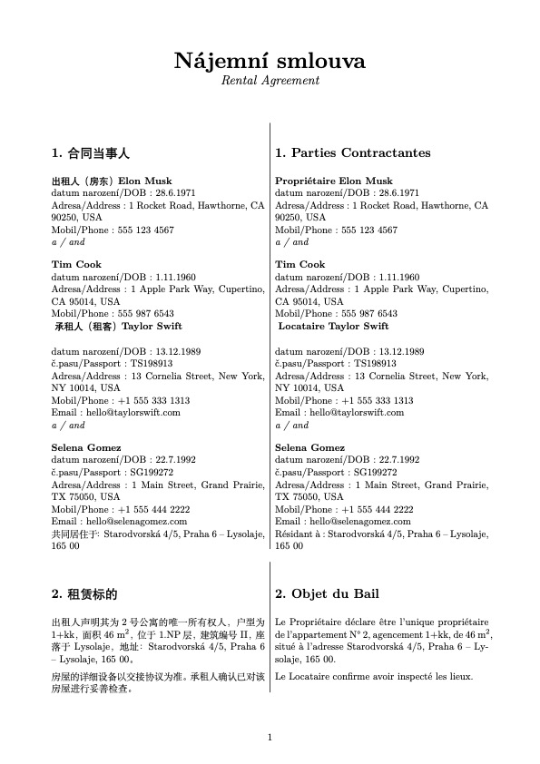

# PolyContract Engine


[中文文档](README_zh.md) | English

**PolyContract Engine** is a highly extensible, programmatic, and modular multilingual legal contract rendering engine built natively with LuaLaTeX. 

Designed specifically to serve as the document-generation backend for web applications (frontend/backend), it cleanly decouples contract data from presentation. It aims to support infinite contract types (Rental, NDA, Employment) and limitless languages in professional side-by-side or single-column formats.

<p align="center">
  
</p>

## Features
- **JSON Driven Web Architecture:** Your APIs simply push a `data.json` configuration payload. No messy string-templating or RegEx hacking needed; Lua bridges the web data directly into the LaTeX typesetting environment.
- **Dynamic Modular Expansion:** Built to eventually support hundreds of modular clauses (`modules/`). The engine executes `loader.lua` directly via `\directlua` at compilation to dynamically load, translate, and loop through data objects (e.g., arrays of landlords, tenants, or bespoke clauses).
- **Enterprise Internationalization:** Backed by `polyglossia` and `paracol`, it flawlessly renders complex legal documents in multilingual side-by-side layouts tailored for international agreements.
- **Immaculate Zero-Debris Builds:** The sophisticated `build.sh` script parses the JSON payload to dynamically name the output file (e.g., `Contract_Taylor_Swift.pdf`) and securely sandboxes all intensive LaTeX auxiliary artifacts into a `dist/` directory.

## Future Roadmap
- [ ] **Expanded Contract Library:** Adding Non-Disclosure Agreements (NDAs), Employment Contracts, and Sales Agreements.
- [ ] **REST API Wrapper:** A lightweight backend (Node/Python) to securely receive JSON, trigger the `Makefile`, and return the generated PDF stream.
- [ ] **Full Web Client:** A complete React/Vue frontend for users to fill forms explicitly mapping to `data.json`.

## Structure
```text
latex-rental-contract/
├── data.json               # Define language, load clauses, and set contract data
├── Makefile                # make all -> automatically parses tenant name and executes build
├── src/                    
│   ├── main.tex            # Main modular document 
│   ├── loader.lua          # Lua logic converting JSON arrays to robust LaTeX commands
│   ├── styles.sty          # Font encodings, styling, geometries 
│   └── modules/            # Clauses grouped by ISO language codes (cz/en)
└── dist/                   # Holds strictly the final rendered PDF (Gitignored)
```

## Getting Started

### Prerequisites
You need a full TeX distribution equipped with LuaLaTeX.
- **macOS:** `brew install --cask mactex` or via MacPorts `sudo port install texlive-luatex`
- **Linux:** `sudo apt install texlive-full`

### Usage
1. Provide your web client data or manually edit `data.json`.
2. Open terminal in the project root:
```bash
make clean
make all
```
3. Read the output pdf inside `dist/Contract_<TenantName>.pdf`!

## License & Legal Disclaimer

This project is licensed under the [MIT License](LICENSE).

> **Disclaimer**: The contract templates, clauses, and sample legal documents provided in this repository are for demonstration, formatting, and document automation purposes only. They do not constitute formal legal advice. Contract and rental requirements vary significantly across legal jurisdictions; consult qualified legal counsel before using any generated contracts for binding transactions.

